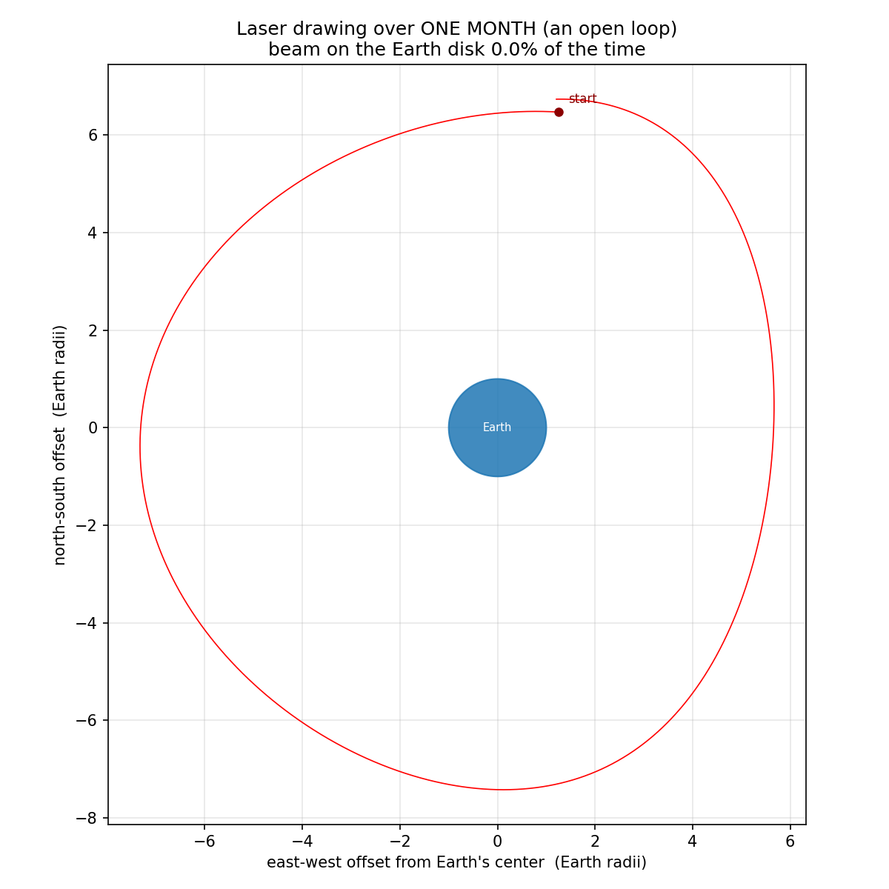
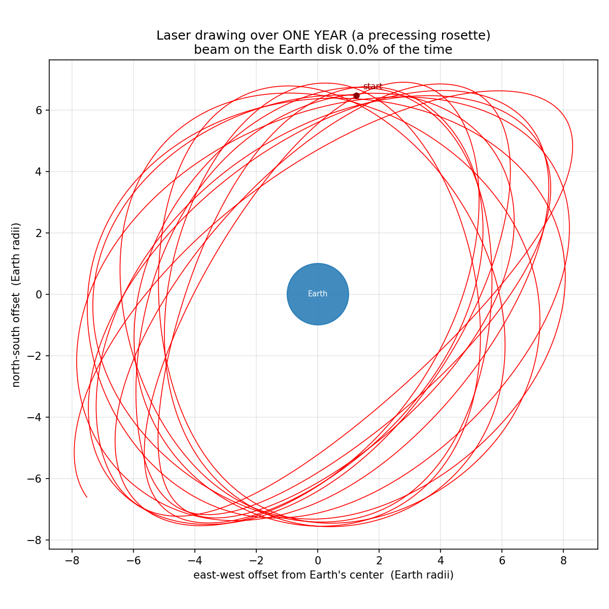
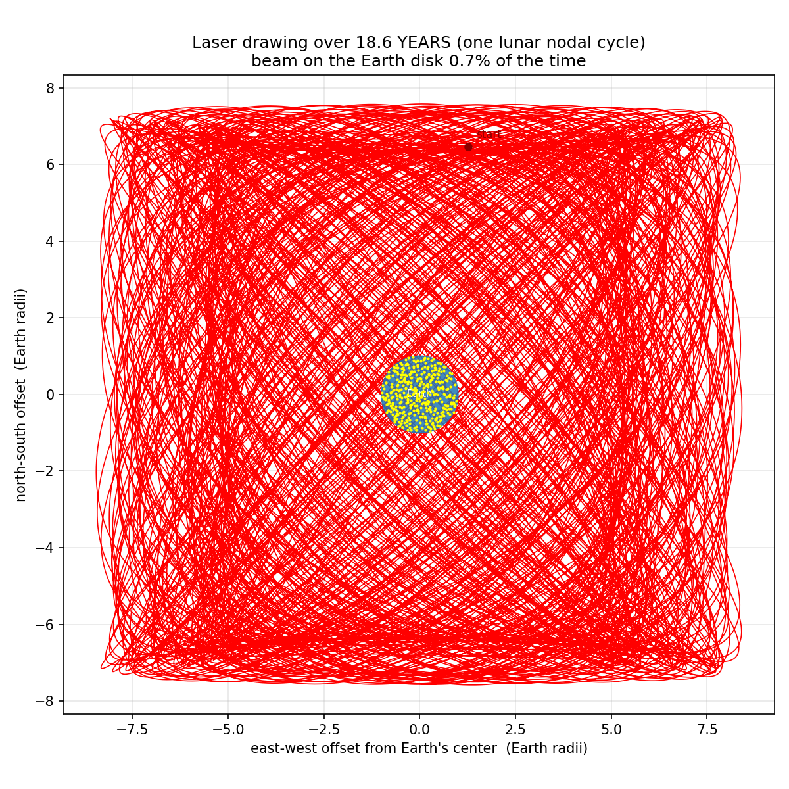
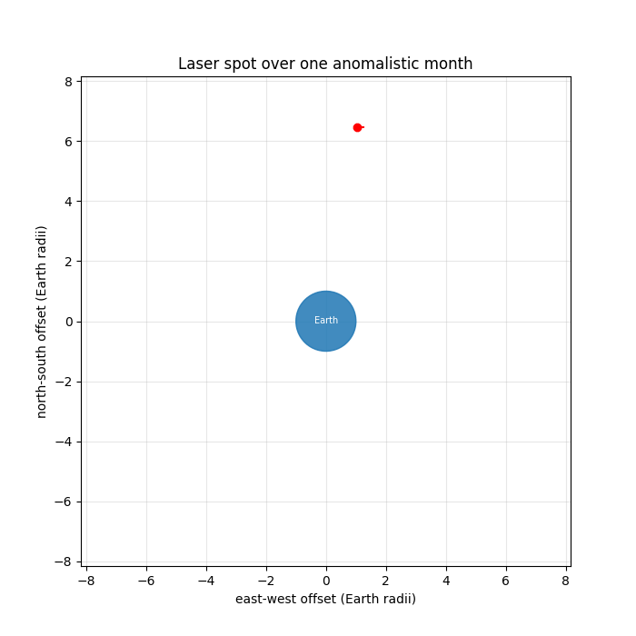
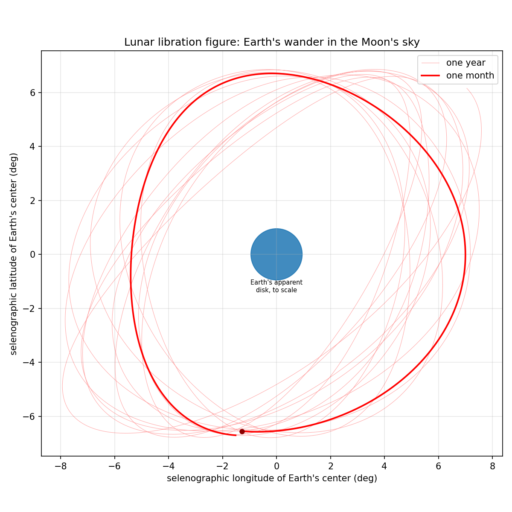
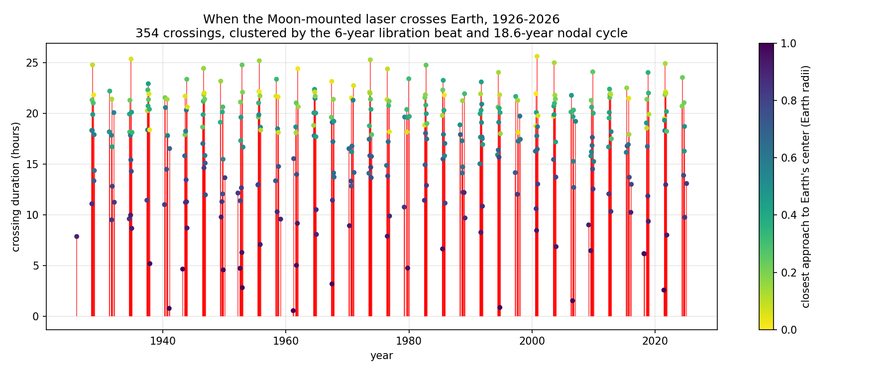

# Moon Libration Laser Simulator

You just landed at the center of the Moon's visible face (the mean
sub-Earth point) and bolted a laser to a tripod, aimed at the spot where
Earth's center sits *on average*. The Moon's **libration** — its slow
apparent wobble — means Earth doesn't stay put in the lunar sky. What
does the laser draw over a day? A month? A year?

> Note on naming: the wobble is *libration* (from Latin *libra*, balance).
> A *libation* is a drink poured for the gods — also appropriate after
> hauling a tripod to the Moon.

## The answer

Earth subtends only **~1.9°** seen from the Moon, but libration swings
Earth's apparent position by up to **±7.9° in longitude** and **±6.9° in
latitude**. At the Earth–Moon distance (356,000–407,000 km), one degree
of libration moves the beam ~6,600 km in the target plane. So the rigid
laser sweeps a canvas roughly **±8.5 Earth radii (±54,000 km)** across —
and **misses Earth almost all of the time**.

| Time span | Shape drawn |
|---|---|
| **1 day** | A short, nearly straight arc (~2 Earth radii long). Dominated by libration in longitude; physical libration and the changing distance bend it slightly. |
| **1 month** | A big **open loop** around Earth, ~15 Earth diameters wide. It doesn't close, because the two driving periods differ: longitude libration follows the anomalistic month (27.55 d) and latitude libration the draconic month (27.21 d). In many months the beam never touches Earth at all. |
| **1 year** | A **precessing rosette** — the monthly loop slowly rotates and changes shape as the phase between the two librations drifts (beat period ≈ 6 years). |
| **18.6 years** | One full lunar nodal cycle: a dense Lissajous-like weave that finally fills the whole libration figure. Even then the beam is on the Earth disk only **~0.7%** of the time. |

| One month | One year | 18.6 years |
|---|---|---|
|  |  |  |

Animated (one month):



The classic *libration figure* (Earth's wander in the Moon's sky, in
selenographic coordinates — the laser drawing is this shape mirrored and
scaled by distance):



## How it's computed

`laser_simulator.py` uses real JPL data — no analytic approximations:

1. **DE440s** planetary ephemeris gives the Earth and Moon barycentric
   positions (the same ephemeris JPL uses for mission navigation).
2. **`moon_pa_de421_1900-2050.bpc`** gives the Moon's true orientation
   (Euler angles numerically integrated alongside DE421), which includes
   the *physical* librations, not just the optical ones.
3. **`moon_080317.tf`** defines the **MOON_ME** ("Mean Earth / Polar
   Axis") body-fixed frame — the frame lunar maps and landers use, whose
   +X axis pierces the mean sub-Earth point. That +X axis *is* the laser.

Earth's center is expressed in the MOON_ME frame as (lon, lat, d). In the
target plane through Earth's center perpendicular to the beam, the spot's
offset from Earth's center is simply
`(-d·cos lat·sin lon, -d·sin lat)` — exact, and independent of whether the
tripod stands at the Moon's center or on its surface, since both lie on
the +X axis. The kernels are downloaded automatically on first run
(~47 MB, cached in `kernels/`).

## Run it

```bash
pip install skyfield matplotlib numpy   # or: poetry install
python3 laser_simulator.py              # writes PNGs to output/
python3 laser_simulator.py --gif        # also renders the month animation
python3 laser_simulator.py --start 2030-01-01
```

## When does the laser actually hit Earth?

`crossing_finder.py` scans the century 1926–2026 at 10-minute resolution
and bisects every disk entry/exit to ~1-second precision:

```bash
python3 crossing_finder.py                    # 1926..2026
python3 crossing_finder.py --start 1900 --end 2050
```

Results for 1926–2026 (full table with exact UTC entry/exit times in
[`output/earth_crossings_1926_2026.csv`](output/earth_crossings_1926_2026.csv)):

* **354 crossings**, beam on the Earth disk **0.689%** of the time
  (6,036 hours in a century).
* Each crossing lasts **8–25 hours** (the spot moves ~460 km/h through
  a disk 12,742 km wide).
* Crossings come in **seasons every ~3.0 years** — half the ~6-year beat
  between the anomalistic (27.55 d) and draconic (27.21 d) months — each
  season lasting 5–10 months with **8–13 crossings spaced ~13.7 days**
  (half a draconic month, each time the latitude libration crosses zero).
* Best shot of the century: **1955-09-23 08:55 UTC**, when the beam axis
  passed within ~4 km of Earth's center.



## Interactive website

`docs/` contains a static site (GitHub Pages-ready) that plays the laser's
red line over the full century — press play to watch a year per minute,
change speed and trail length, scrub the timeline, and click any of the
354 crossings to jump there:

```bash
python3 export_web_data.py            # regenerate docs/data/ (needs the CSV)
cd docs && python3 -m http.server     # then open http://localhost:8000
```

To publish, enable GitHub Pages for the `main` branch, `/docs` folder.

## Accurate Moon/Earth movement libraries (the survey)

Libraries and data sources that carry real libration/orientation data,
roughly in order of usefulness for this problem:

| Library / data | What it provides | Notes |
|---|---|---|
| **[Skyfield](https://rhodesmill.org/skyfield/)** (used here) | Positions from JPL ephemerides **plus lunar body-fixed frames** (`PlanetaryConstants`) | The only pure-Python stack that exposes the Moon's true rotational state. Built on `jplephem`. |
| **[JPL ephemerides](https://ssd.jpl.nasa.gov/planets/eph_export.html)** DE440/DE441/DE421 | The underlying truth: numerically integrated positions, fit to lunar laser ranging | DE440s (1849–2150) used here; DE441 covers ±13,000 years. |
| **[NAIF SPICE kernels](https://naif.jpl.nasa.gov/naif/data_generic.html)** (`moon_pa_*.bpc`, `moon_*.tf`) | Lunar Principal Axis / Mean Earth orientation frames | The same files every lunar mission uses. |
| **[spiceypy](https://github.com/AndrewAnnex/SpiceyPy)** | Full NASA SPICE toolkit in Python | The heavyweight alternative: `spkpos('EARTH', et, 'MOON_ME', 'LT+S', 'MOON')` does this in one call. More setup, mission-grade. |
| **[astropy](https://www.astropy.org/)** + `jplephem` | Earth/Moon positions via `get_body('moon', t, ephemeris='jpl')` | What the earlier `moon*.py` experiments used. Great for positions, but it has **no lunar orientation frame**, so it can't do physical libration by itself. |
| **[JPL Horizons](https://ssd.jpl.nasa.gov/horizons/)** (via `astroquery.jplhorizons`) | Observer tables including ready-made libration angles (`ObsSub-LON`, `ObsSub-LAT`) | Perfect for cross-checking this simulator against JPL's own numbers. |
| **[lunarsky](https://github.com/aelanman/lunarsky)** | Astropy frames for observers *on* the Moon (MCMF frame, lunar topocentric) | Useful if you extend this to a specific landing site. |
| **ELP2000-82B / ELP/MPP02** (semi-analytic theory) | Lunar position as trig series | What classic almanacs use; superseded in accuracy by the numerical DE ephemerides. |
| **PyEphem** | Fast approximate positions + optical libration | Legacy (libastro); fine for visualization, not research-grade. |

Why the librations exist, briefly:

* **Longitude (±7.9°, 27.55 d):** the Moon's spin is uniform but its
  orbital speed isn't (eccentricity e ≈ 0.055), so the face leads/lags.
* **Latitude (±6.9°, 27.21 d):** the lunar equator is tilted 6.68° to the
  orbit plane, so we alternately peek over its north and south poles.
* **Physical libration (~0.03°):** the Moon genuinely rocks on its axis —
  included here via the DE421 orientation kernel.
* **18.6-year cycle:** the orbit's nodes regress, slowly rotating the
  whole pattern.

## Legacy experiments

`moon.py` … `moon8_mollweide_projection.py` are earlier astropy-based
experiments kept for reference; `laser_simulator.py` supersedes them.
